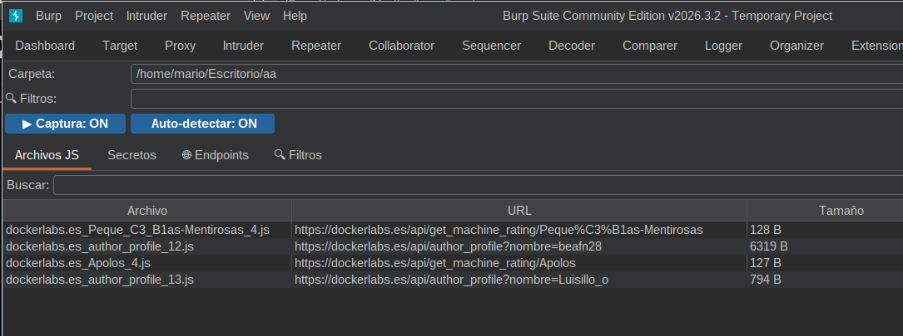
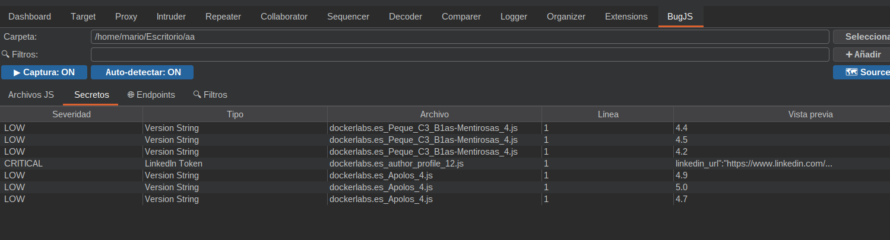
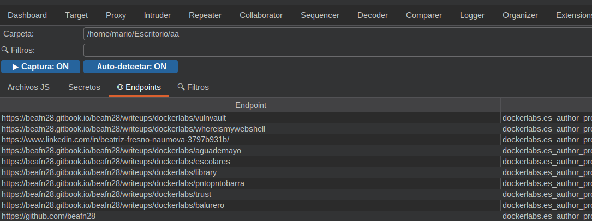

# BugJS - Extensión Bug Bounty para Burp Suite



Extensión avanzada de Burp Suite diseñada para **Bug Bounty** que captura, analiza y extrae automáticamente información sensible de archivos JavaScript.

## Características Principales

### 🔴 Detección Automática de Secretos
- **AWS Access Keys** - AKIA... 
- **Google API Keys** - AIza...
- **Stripe Keys** - sk_live..., pk_live...
- **GitHub Tokens** - ghp_..., gho_...
- **Slack Tokens** - xoxb..., xoxp...
- **Discord Webhooks** - URLs completas
- **JWT Tokens** - eyJ...eyJ...
- **Bearer Tokens** - Authorization headers
- **Database Connections** - mongodb://, mysql://, postgresql://
- **Private Keys** - RSA, SSH, etc.
- **Passwords hardcodeadas** - password=..., secret=..., api_key=...

### 🌐 Extracción de Endpoints
Detecta automáticamente URLs de API y endpoints internos:
- `/api/v1/users`, `/admin/dashboard`
- URLs de fetch/XHR
- GraphQL endpoints

### 🎨 Sistema de Severidad
- **🔴 CRÍTICO**: API keys, tokens, credenciales, private keys
- **🟡 MEDIO**: Endpoints de admin, URLs internas
- **🟢 INFO**: Comentarios TODO/FIXME, versiones

### 📊 Exportación de Reportes
Genera reportes JSON con:
- Todos los archivos analizados
- Secretos encontrados con línea exacta
- Endpoints descubiertos
- Timestamp de análisis

## Instalación

1. Compila el proyecto con Maven:
   ```bash
   mvn clean package
   ```

2. El JAR se generará en:
   ```
   target/bugjs-1.0.0-jar-with-dependencies.jar
   ```

3. En Burp Suite:
   - Ve a **Extensions → Installed → Add**
   - Selecciona **Extension type: Java**
   - Carga el archivo JAR generado

## Uso

### Configuración inicial

1. En la pestaña **"bugjs"** que aparece en Burp Suite:
   - Selecciona la **📁 carpeta de destino** donde se guardarán los archivos JS
   - Activa/desactiva los toggles según necesites:
     - **▶️ Captura**: ON/OFF para habilitar/deshabilitar captura automática
     - **🔮 Auto-detectar**: ON/OFF para detección automática de secretos
     - **🗺️ Source Maps**: ON/OFF para intentar descargar archivos .js.map

### Tabs de la extensión

#### 🔍 Filtros
- Añade palabras clave personalizadas (ej: `token`, `api`, `password`)
- Las etiquetas aparecen en azul con **×** para eliminar
- **Limpiar filtros** elimina todos de una vez

#### 📁 Archivos JS
- Lista todos los archivos capturados
- Columna **Secretos**: Muestra 🔴 si hay hallazgos críticos
- Columna **Severidad**: CRITICAL/MEDIUM/LOW/INFO
- **Buscar**: Filtra por nombre o contenido del archivo
- **Doble clic**: Abre el archivo con el editor del sistema
- **Clic derecho**: Menú contextual con opciones

#### 🔴 Secretos


- Lista todos los secretos detectados automáticamente
- Ordenados por severidad (críticos primero)
- Muestra: Tipo, Archivo, Línea, Vista previa
- Doble clic para abrir el archivo JS correspondiente

#### 🌐 Endpoints


- URLs de API y endpoints descubiertos
- Botón **"Enviar a Repeater"** para enviar directamente a Burp Repeater
- Origen: archivo fuente donde se encontró

### Botones inferiores
- **📊 Exportar Reporte**: Genera JSON con todos los hallazgos
- **🗑️ Limpiar todo**: Elimina archivos físicos y limpia todas las tablas

## Patrones de detección automática

La extensión detecta automáticamente:

| Tipo | Patrón | Severidad |
|------|--------|-----------|
| AWS Access Key | AKIA... | 🔴 CRÍTICO |
| AWS Secret | 40 chars base64 | 🔴 CRÍTICO |
| Google API Key | AIza... | 🔴 CRÍTICO |
| Stripe Live Key | sk_live... | 🔴 CRÍTICO |
| GitHub Token | ghp_... | 🔴 CRÍTICO |
| Slack Token | xoxb... | 🔴 CRÍTICO |
| Discord Webhook | discord.com/api/webhooks | 🔴 CRÍTICO |
| JWT Token | eyJ...eyJ...sig | 🔴 CRÍTICO |
| Password | password=... | 🔴 CRÍTICO |
| Private Key | -----BEGIN... | 🔴 CRÍTICO |
| API Endpoint | /api/... | 🟡 MEDIO |
| Admin Panel | /admin/... | 🟡 MEDIO |
| TODO Comment | // TODO | ⚪ INFO |
| FIXME Comment | // FIXME | ⚪ INFO |

## Requisitos

- Java 17 o superior
- Burp Suite (cualquier edición compatible con la API Montoya)
- Maven (para compilar desde el código fuente)

## Screenshots

### Interfaz principal


### Detección de secretos


### Endpoints descubiertos


## Estructura del proyecto

```
burpsj/
├── src/
│   ├── main/
│   │   └── java/burpsj/burpsj/
│   │       ├── JsSaver.java          # Punto de entrada de la extensión
│   │       ├── JsHandler.java        # Manejador de tráfico HTTP
│   │       ├── MySettingsPanel.java  # Interfaz de usuario
│   │       └── SecretDetector.java   # Detector de secretos
│   └── test/
│       └── java/burpsj/burpsj/
│           └── AppTest.java
├── .github/workflows/                 # GitHub Actions CI/CD
├── media/                             # Imágenes y screenshots
├── pom.xml                           # Configuración de Maven
└── README.md                         # Este archivo
```

## Licencia

Proyecto de código abierto para uso personal y educativo.

## CI/CD - GitHub Actions

El proyecto incluye workflows automáticos:

- **Build**: Compila en cada push a `main`
- **Release**: Crea releases automáticas cuando se crea un tag `v*`

Para crear una release:
```bash
git tag -a v1.0.0 -m "BugJS v1.0.0"
git push origin v1.0.0
```

## Autor

Desarrollado para facilitar el análisis de archivos JavaScript en pruebas de seguridad web.

---
⭐ Si te es útil, dale una estrella al repo
